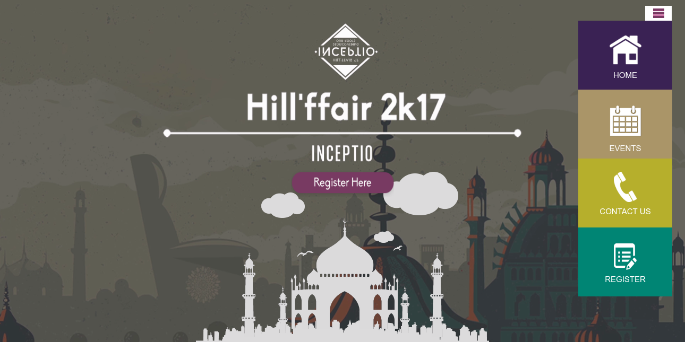
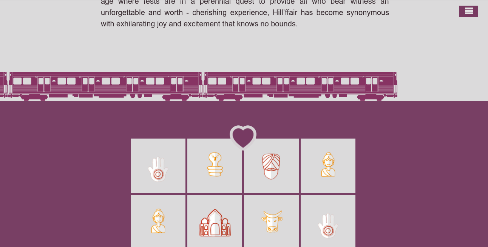
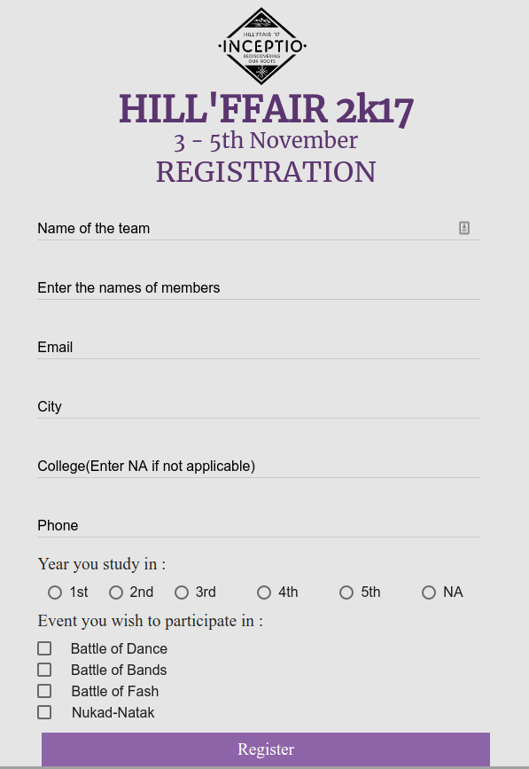

# Hillffair
It is cultural fest website of our college. All details of club events and registration of students for events in fest.It is entirely written in HTML/CSS/JS/Mongoose/Node.js.

Live link at 
https://hillffair2k17.herokuapp.com/

## HomePage
It's dashboard where details of all exams can be seen and you can seen how many exams are in progress or upcoming or completed. 

## 

## Registration
Here, you can see registration of students in evenst and they get notified about the registration.

These are basic features of my work, there are others also you can check it on given link https://hillffair2k17.herokuapp.com/
